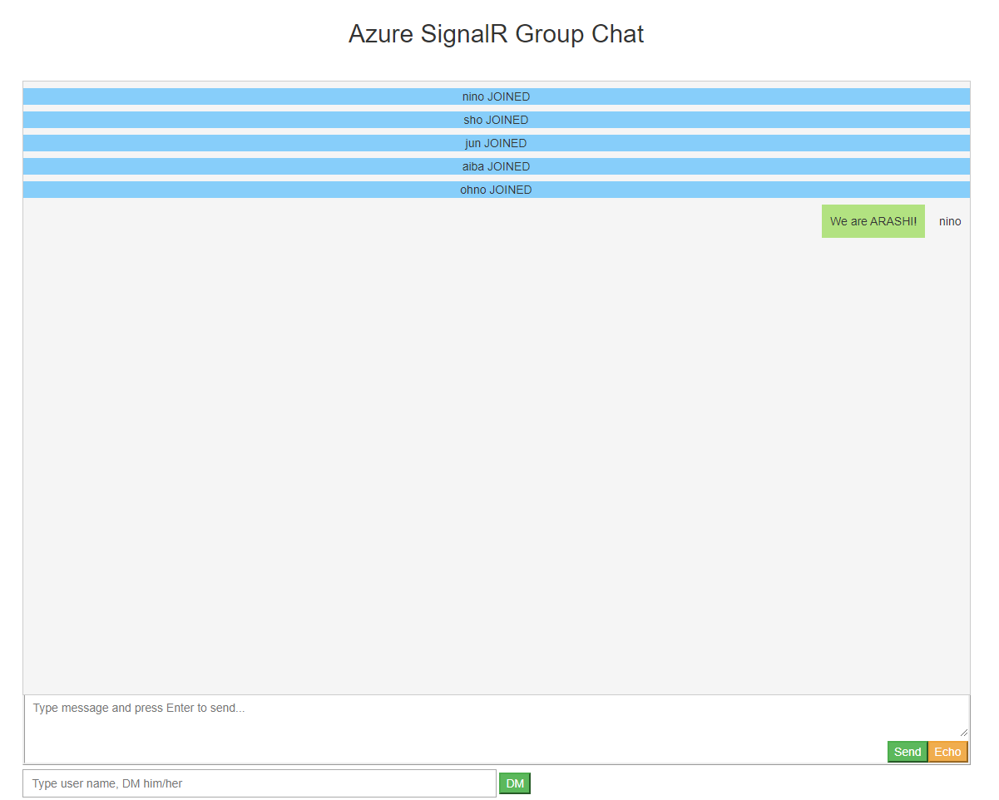
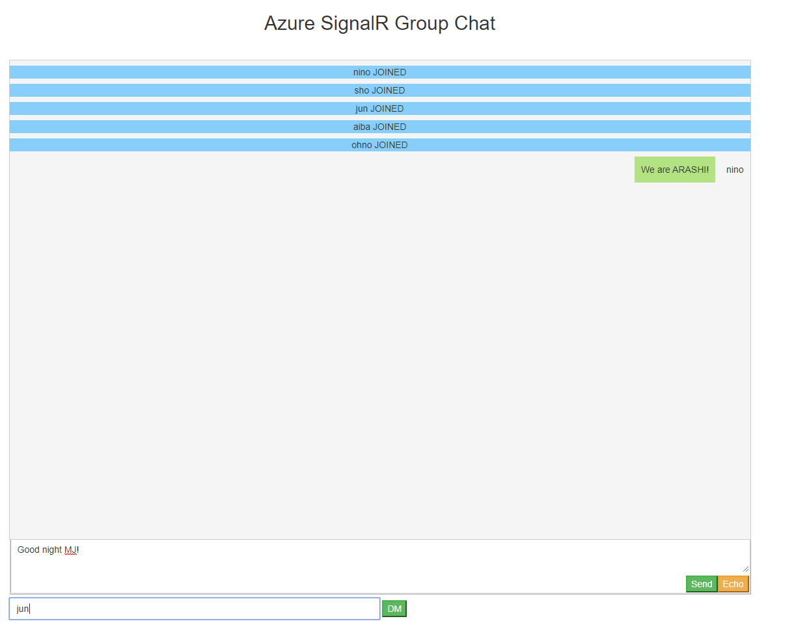
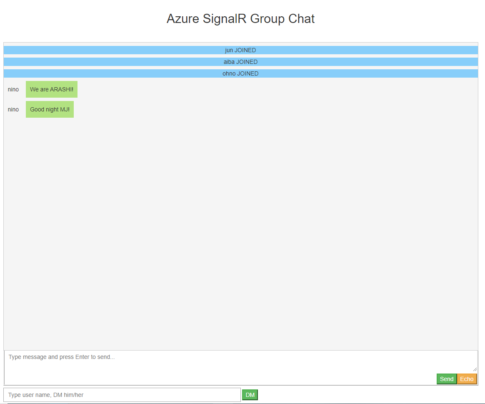
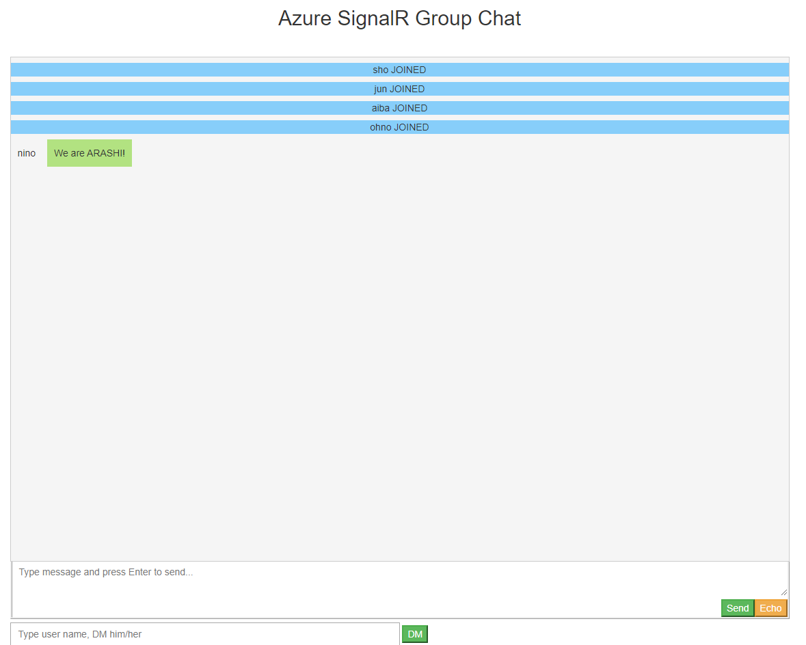

# ServerlessChatRoom
A memo for the practice using Azure SignalR &amp; Azure Functions to build a serverless chat room. Have broadcast, echo and DM features.



## Workflow Overview
1) When a user joins the chat room, a http request is sent to trigger the **negotiate** http trigger function and get the SignalR URL and access token.
2) The client side starts connection with SignalR with the previous URL and access token.
3) For broadcasting a message, client side sends a http request to trigger the **broadcast** http trigger function, gets the SignalRMessage containing target method name and arguments that a hub can call.
4) For echo and DM, it works similar as broadcasting as long as the user is authenticated by userId when starts to negotiate at the beginning.

## Important Codes Go Trough
### DM feature
When client side starts to negotiate, we parse his/her name as userId. This helps SignalR send the message to specific user.
```javascript
            function joinChatRoom(userId) {
                $.ajax({
                    headers: { 'x-ms-signalr-userid': userId },
                    url: 'http://localhost:7071/api/negotiate',
                    type: 'GET',
                    timeout: 10000,
                })
                    .done(function (result) { startConnection(result.url, result.accessToken) })
                    .fail(function (XMLHttpRequest, textStatus, errorThrown) {
                    });
           
            joinChatRoom(username)
```
Since I didn't user Azure function built-in authentication service, the headers used to pass userId should be *x-ms-signalr-userid*
This header can be found from this microsoft [docs](https://github.com/Azure/azure-functions-signalrservice-extension/blob/bcc4e549f8306b0f869e001572ec35ce69d81f6c/samples/simple-chat/content/index.html#L143)
```C#
       [FunctionName("negotiate")]
        public static SignalRConnectionInfo GetSignalRInfo(
            [HttpTrigger(AuthorizationLevel.Anonymous, "get", "post")] HttpRequest req,
            [SignalRConnectionInfo(HubName = "chat", UserId = "{headers.x-ms-signalr-userid}")] SignalRConnectionInfo connectionInfo)
        {
            return connectionInfo;
        }
```
when user inputs message and the specific user name, then clicked **DM**, this will invoke the echo function on the client side
```javascript
                    document.getElementById('senduser').addEventListener('click', function (event) {
                    // call the echo method on the hub.
                    if (userInput.value && messageInput.value) {

                        echo(username, userInput.value, messageInput.value);
                    }

                    // clear text box and reset focus for next comment.
                    messageInput.value = '';
                    messageInput.focus();
                    event.preventDefault();
                });
```
```javarscript
                function echo(name, userId, message) {
                $.ajax({
                    url: 'http://localhost:7071/api/senduser',
                    type: 'GET',
                    data: {
                        name: name,
                        userId: userId,
                        message: message
                    },
                    timeout: 10000,
                }).done(function (data) {
                }).fail(function (XMLHttpRequest, textStatus, errorThrown) {
                });
            }
```
The echo function on the client side send http request to trigger the **senduser** http trigger function, this function helps SignalR to only send this message to the specific user:
```csharp
        [FunctionName("senduser")]
        public static Task PrivateMessageToQueue(
            [HttpTrigger(AuthorizationLevel.Anonymous, "get", "post")]HttpRequest req,
            [SignalR(HubName = "chat")] IAsyncCollector<SignalRMessage> signalRMessages)
        {
            string name = req.Query["name"];
            string userId = req.Query["userId"];
            string message = req.Query["message"];

            return signalRMessages.AddAsync(
                new SignalRMessage
                {
                    UserId = userId,
                    Target = "echo",
                    Arguments = new[] { name, message }
                });
        }
```
Target method name should match the name on this hub:
```javascript
        connection.on('echo', messageCallback);
```
**Demo Results(Only jun receive message from nino):**





## How To Use For Fun On Local
1) Run the azure functions. Remember to put your Azure SignalR connection string in the *local.settings.json* file. CORS is already set as "\*" on local
2) Run *index.html* using browser
3) Just play with yourself **:)**

## How To Use on Azure Portal
**Prep**: Make sure have a storage account. Then go to container and add a Blob storage container. In my practice I created a *wwwroot* Blob container and uploaded *index.html*, also uploaded the *cite.css* file under css folder (set in advanced settings) in this container.

1) Publish the Azure Function App to Azure. 
- Remember to create *proxies.json* and set the backenduri to read the files from Blob. Before publishing you have to set this file's properties >Copy to Output Directory -> **Copy Always**. 
- Also set the *BlobHost* in this app settings.
- Change this Function App's CORS setting to **Enable Access-Control-Allow-Credentials** and add Azure SignalR endpoint.
2) Change the corresponding URL in *index.html* to your Azure Function App URL. eg:
> http://localhost:7071/api/negotiate --> https://<function_app_name>.azurewebsites.net/api/negotiate
3) Upload *index.html* and *site.css* under the correct paths which match the routes you set in the *proxies.json*
4) Test it as you want **:)**

## Resources
Apart from the official Microsoft tutorials, this [repository](https://github.com/yossy6954/ServerlessChatRoom) gives me a whole view of how to deploy this project to Azure and internal interactions among client-signalr-functions. Many thanks.


